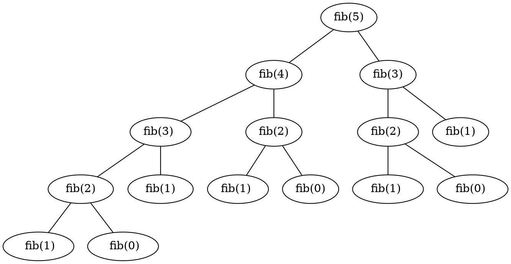

在实际开始讨论数据结构与算法之前，需要先讨论一些基础知识，这些基础知识要么很重要，要么是看上去不太重要容易被忽略的。

<!--more-->

## 递归思想

递归是一种编程技巧，它可以让我们把一个复杂的问题分解成多个相似的子问题，然后逐个解决子问题，最后把子问题的解合并起来得到原问题的解。

递归的本质是函数自身调用自身，这种调用称为递归调用。递归调用的过程中，每次调用都会把原问题分解成更小的子问题，直到子问题的规模足够小，可以直接求解，这时就不再需要递归调用，而是直接返回子问题的解。

递归调用的过程中，每次调用都会把原问题分解成更小的子问题，直到子问题的规模足够小，可以直接求解，这时就不再需要递归调用，而是直接返回子问题的解。

好了，概念很多人都在说，很多人刚学编程的时候也都被老师教过，递归就把递归展开推导一下，比如一个基本的 fibonacci 数列：

```c
int fib(int n) {
    if (n <= 1) {
        return n;
    }
    return fib(n - 1) + fib(n - 2);
}
```

展开会变成什么样子呢？它成了一颗树，每个节点都是一个函数调用，每个节点的值都是函数的返回值，这个树的根节点就是我们要求的 fib(n) 的值。



jyy 说过，程序是个状态机，为什么你写不出递归？因为我们人脑很难维护这么多状态，否则我们也不需要调试器，甚至不需要计算机了。

正确对待递归的方法是不要展开递归，而是充分使用数学归纳法的思想。

例如上面的 fibonacci 数列，我们可以这样思考：

1. 首先要设定停机策略，这个停机策略就是递归出口。在上面的例子中，fib(0) 和 fib(1) 是一个确定值，可以作为递归出口
2. 在需要递归的地方，我们直接假设 fib() 可以按照预想的方式工作，也就是说我们可以假定 fib(n) = fib(n - 1) + fib(n - 2) 成立，这样我们就可以把 fib(n) 看成是 fib(n - 1) 和 fib(n - 2) 的和
3. 根据数学归纳法的思想，我们可以假设 fib(n) = fib(n - 1) + fib(n - 2) 成立，那么我们就可以推导出 fib(n + 1) = fib(n) + fib(n - 1) 成立，这样我们就可以把 fib(n + 1) 看成是 fib(n) 和 fib(n - 1) 的和
4. 就这样，递归自然就能够证明了

因此，要思考的是如何通过这个一定成立的函数得出下一次的状态，这样一来递归就非常简单且好理解了，甚至你会爱上递归，在许多不该用递归的地方也要递归，当然这都是后话了。

例如上面的 fibonacci 数列，在确定了停机策略后，我们需要思考使用怎样的表达式可以得到 fib(n) 的值，这个表达式就是递归的核心。根据 fibonacci 数列的数学性质，不难得到表达式应该是 `fib(n) = fib(n - 1) + fib(n - 2)`

显然，这个表达式是一个递归表达式，我们可以把它看成是一个状态转移方程，它的意思是：`fib(n)` 的值等于 `fib(n - 1)` 和 `fib(n - 2)` 的和。这个表达式的意思是，我们可以通过前两个状态得到下一个状态，这就是状态机的思想。

当然这个算法复杂度是极高的，它是指数级递增的，如何优化就不是本文的重点了。

## 算法复杂度与 Big O

假定存在一种计算机，它每完成一条指令需要一个周期，那么执行一段代码的时间复杂度就是指令的数量。我们在研究算法的复杂度时，通常研究的就是该抽象环境下的函数的执行情况。

算法导论给出了一种抽象的模型：RAM 机模型，简单来说，RAM 机可以视为一种真实计算机具有的计算指令集，每个周期执行一条指令，这样一来就可以把算法分析抽象成计算指令的数量。

更加抽象的结果中，我们只关心运行时间的增长率，所以我们只考虑影响运行时间的最高次数项。当输入的 $n$ 趋近于无穷大时，根据极限思想可得出，除了最高次数项以外的项都可以忽略不计，最高次项的常数系数也可以忽略不计，因此我们只需要关注最高次项的次数。

通常我们只研究最坏情况的复杂度，有时我们也会讨论平均情况的复杂度。

根据上述的抽象，例如对于一个插入排序的算法，最坏的情况下，其复杂度可以描述为 $\Theta(n^2)$。这种描述方式称为渐进记号，它描述了一个函数随着输入的增大而增长的速度。

在数学定义中，渐进符号 $\Theta$ 定义了函数增长率的上界和下界，即 

$$\Theta(g(n)) = \{f(n): \exists c_1, c_2, n_0 > 0, \forall n \ge n_0, 0 \le c_1g(n) \le f(n) \le c_2g(n)\}$$

其中 $c_1, c_2$ 为常数，$n_0$ 为正整数。

但在实际应用中，我们通常只关心渐进上界，因此我们可以简化为

$$O(g(n)) = \{f(n): \exists c, n_0 > 0, \forall n \ge n_0, 0 \le f(n) \le cg(n)\}$$

此时，我们使用渐进符号 $O$ 来表示。

虽然给了很多数学定义，但我不是研究数学的，因此我打算给出一个没那么严谨但至少讲人话的定义：

一般情况下，算法的基本语句重复执行的次数是关于问题规模 $n$ 的一个函数 $f(n)$，算法的时间量度记作：

$$T(n)=O(f(n))$$

$O$ 记号用来表示算法的最坏情况下运行时间的上界。算法执行的时间的增长率在数据规模 $n$ 不断增大的情况下和 $f(n)$ 增长率相同，即：

$$\lim_{n \to \infty} \frac{T(n)}{f(n)} = c $$

其中 $c$ 是一个正整数。根据这个定义，我们可以认为 $T(n)$ 和 $f(n)$ 是同阶的，即其增长率相同。

我们定义这为算法的渐进时间复杂度，通常直接省略称作时间复杂度，记为 $O(f(n))$。

但许多时候，$O$ 记号使用的场合并不严谨，有时也约定俗成地使用 $O$ 符号代表平均时间复杂度，例如我们许多时候说快速排序的时间复杂度是 $O(n\log n)$，但实际上它最坏情况下的时间复杂度是 $O(n^2)$

类似的，对于算法占用的空间，也使用类似的方式讨论，称其为渐进空间复杂度，记为 $O(g(n))$。

## 抽象数据类型

抽象数据类型 (abstract data type, ADT) 指一些操作的集合。抽象数据类型是一种数学概念上的抽象，其定义了对该数据结构的基本定义，以及对该数据结构可以有何操作，但并没有定义具体如何实现这些操作。

例如，对于一个栈的 ADT 可以有 `push`、`pop`、`top`、`empty`、`size` 等操作。

我们希望这些操作的实现只编写一次，程序其他部分需要在该 ADT 上的操作可以直接调用对应的函数来执行，理想状态下该数据结构对 ADT 操作的具体实现应当对程序其余部分是透明的。这形成了数据结构良好的抽象。模块化的设计无论是对于学习还是对于实际设计程序都是好的。
